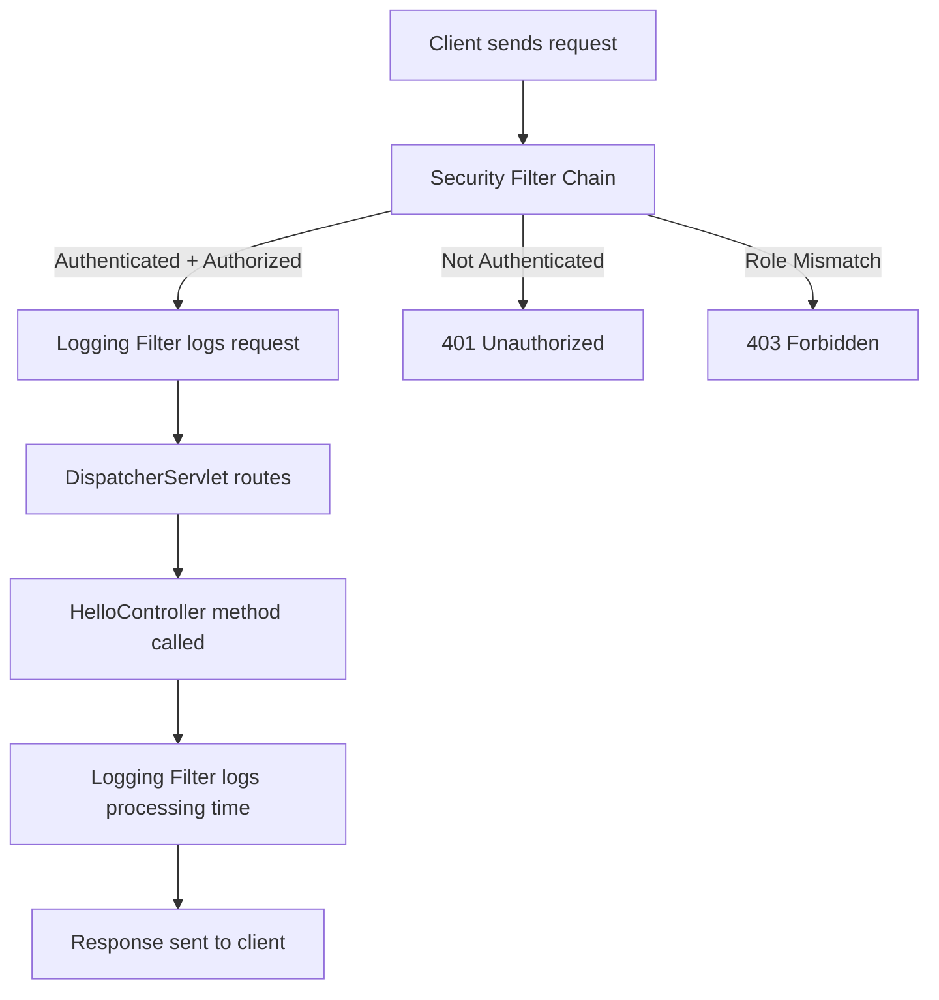

## 🔐 Spring Security with Role-Based Access Control (No Spring Boot)

This is a simple yet powerful **Java-based web application** demonstrating how to integrate **Spring Security (version 6.x)** without using Spring Boot. It includes:

* Basic Authentication
* Role-based authorization
* Custom filters for logging
* Pure Java + XML config (ideal for understanding servlet-level security)

---

### 📚 What This Project Teaches You

* ✅ How to configure **Spring Security manually** (no Spring Boot auto-magic)
* ✅ How to define users and roles using **in-memory authentication**
* ✅ How to restrict access to URLs based on **user roles**
* ✅ How to use **HTTP Basic Authentication** (popup login)
* ✅ How to implement a custom **Servlet Filter** to log request info
* ✅ How to deploy to **Tomcat 11+** using **Jakarta Servlet API**

---

### 🔧 Tech Stack

| Component           | Version |
| ------------------- | ------- |
| Java                | 21      |
| Spring Framework    | 6.1.6   |
| Spring Security     | 6.3.1   |
| Jakarta Servlet API | 6.0.0   |
| Maven               | Yes     |
| Apache Tomcat       | 11+     |


### 🌐 Application Endpoints

| Endpoint  | Role Required               | Description                       |
| --------- | --------------------------- | --------------------------------- |
| `/public` | None                        | Open to everyone                  |
| `/hello`  | `ROLE_USER` or `ROLE_ADMIN` | Requires login with USER or ADMIN |
| `/admin`  | `ROLE_ADMIN` only           | Only accessible to admin users    |

---

### 🚦 How It Works

* 🧾 **UserDetailsService Bean** defines two users (`user` and `admin`) with roles and plain text passwords.
* 🛡 **SecurityFilterChain** restricts access to URLs based on user roles.
* 🌐 **Basic Auth** is used – browser shows a popup for username and password.
* 📃 **LoggingFilter** logs each request's IP and execution time.

---

### 🗂 Key Files

| File                   | Description                                       |
| ---------------------- | ------------------------------------------------- |
| `SecurityConfig.java`  | Defines security rules and user details           |
| `HelloController.java` | Contains `/public`, `/hello`, and `/admin` routes |
| `LoggingFilter.java`   | Custom filter that logs request info              |
| `web.xml`              | Sets up filters and the Spring Dispatcher Servlet |
| `pom.xml`              | Declares dependencies using Spring and Jakarta EE |

---

### ✅ How to Run

1. Clone the repository:

   ```bash
   git clone https://github.com/your-username/spring-security-no-boot.git
   ```

2. Import it into your IDE (Eclipse/IntelliJ)

3. Build the project with Maven

4. Deploy the `.war` file to Apache Tomcat 11+

5. Access endpoints:

   * ✅ `http://localhost:8080/app-name/public`
   * 🔐 `http://localhost:8080/app-name/hello`
   * 🔐 `http://localhost:8080/app-name/admin`

---

### ⚠️ Security Note

This project uses `{noop}` for passwords — meaning they’re stored as **plain text**. In real-world apps:

* Use `BCryptPasswordEncoder`
* Store users in a database
* Always hash passwords

---

### 🙋‍♂️ Author

**Vikas Singh**
Passionate Java & Full Stack Developer
🔗 Connect with me on [LinkedIn](https://www.linkedin.com)


or 


## 🚀 Application Flow – Spring Security Servlet Filter Demo

### 🌐 Endpoint Example:

Access via:
📍 [`http://localhost:8080/filter-demo/public`](http://localhost:8080/filter-demo/public)

---

### ✅ Step-by-Step Execution Flow

---

### 1. **Application Initialization**

When the application starts, **Tomcat 11** loads `web.xml`, which initializes:

* 🔐 **`springSecurityFilterChain`** – core Spring Security filter.
* 📋 **`LoggingFilter`** – custom filter that logs incoming requests.
* 🚦 **`DispatcherServlet`** – bootstraps Spring context (`AppConfig`, `SecurityConfig`).

Spring internally:

* Configures **HTTP Basic Authentication**.
* Registers endpoints `/hello`, `/admin`, and `/public` via `HelloController`.

---

### 2. **Client Sends a Request**

The client accesses any of the defined endpoints:

```
http://localhost:8080/filter-demo/public
http://localhost:8080/filter-demo/hello
http://localhost:8080/filter-demo/admin
```

---

### 3. **Spring Security Filter Chain**

The `springSecurityFilterChain` intercepts the request and applies the access rules:

| Endpoint  | Rule                                       |
| --------- | ------------------------------------------ |
| `/public` | ✅ No authentication required (open access) |
| `/hello`  | 🔐 Requires login with role `ROLE_USER`    |
| `/admin`  | 🔐 Requires login with role `ROLE_ADMIN`   |

* If login is required, the browser shows a **Basic Auth prompt**.
* The credentials (e.g., `user/vikas123`, `admin/admin@321`) are verified using `InMemoryUserDetailsManager`.
* If invalid ➡️ `401 Unauthorized`
* If role is insufficient ➡️ `403 Forbidden`

---

### 4. **Custom Logging Filter**

If Spring Security allows the request, the `LoggingFilter` is triggered:

* Logs:

  ```bash
  Request received from: 127.0.0.1
  ```
* Captures start time
* Passes control using `chain.doFilter(...)`

---

### 5. **Request Handling by Spring MVC**

The request reaches the `DispatcherServlet`, which routes it to the appropriate controller method:

| URL       | Controller Method | Response HTML                                                  |
| --------- | ----------------- | -------------------------------------------------------------- |
| `/hello`  | `sayHello()`      | `<h1>Hello from Spring Controller! (USER access)</h1>`         |
| `/admin`  | `adminPage()`     | `<h1>Welcome to Admin Page! (ADMIN access)</h1>`               |
| `/public` | `publicPage()`    | `<h1>This is a Public Page! (No authentication required)</h1>` |

---

### 6. **Logging Filter Post-Processing**

After the controller returns a response:

* `LoggingFilter` logs:

  ```bash
  Request processed in 12 ms
  ```

---

### 7. **Response Returned to Client**

* The final HTML response is sent back to the browser.
* If authentication or role is missing, browser shows an error (401 or 403).

---

### 🔁 Full Lifecycle Summary




